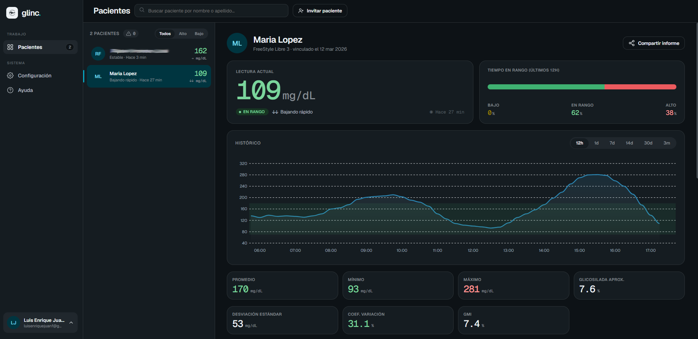
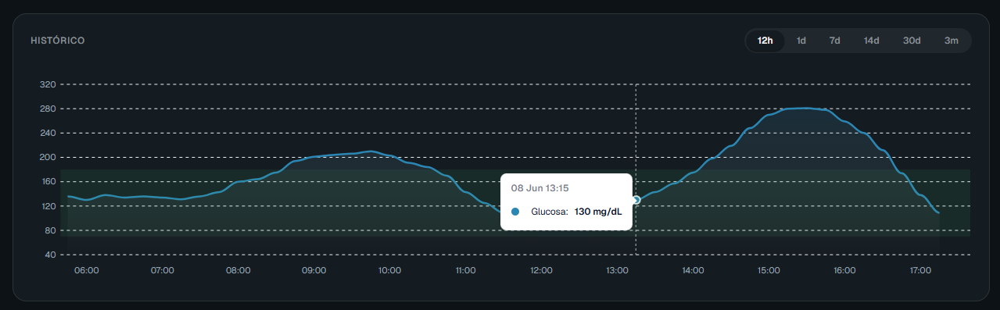
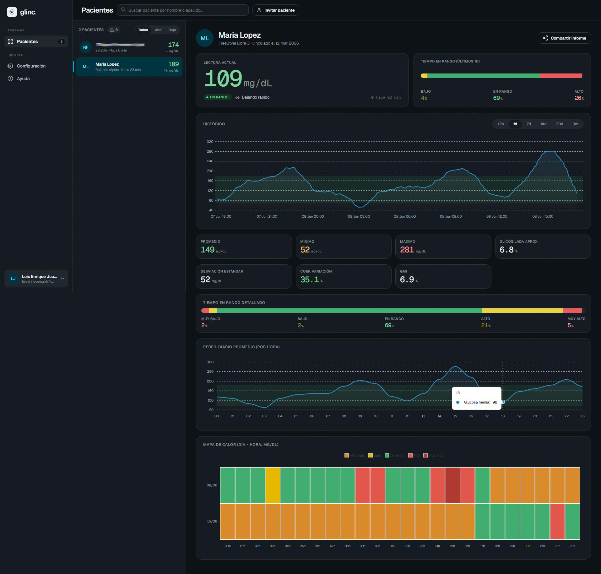
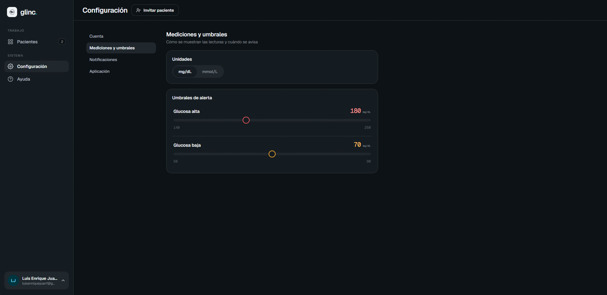

# Glinc

> Monitoreo de glucosa en tiempo real (CGM) multi-paciente sobre FreeStyle Libre.


Glinc permite a un cuidador seguir la glucosa de **todos sus pacientes** de un vistazo, con histórico, estadísticas clínicas y gestión de material y citas. Se conecta a la cuenta de **Abbott LibreLink Up** del paciente y presenta los datos en una app web limpia y en tiempo real.

---

## Qué es

Una persona que cuida a varios pacientes diabéticos (un familiar, un profesional sociosanitario) necesita ver la glucosa de todos ellos sin saltar entre apps. Glinc centraliza ese seguimiento:

- Inicias sesión con tus credenciales de LibreLink Up.
- Glinc descubre automáticamente los pacientes asociados a tu cuenta.
- Ves la última lectura de cada uno, su tendencia y sus alertas en un único dashboard.
- Entras al detalle de cualquiera para ver su histórico, su gráfica y sus estadísticas.

---

## Características

**Dashboard multi-paciente**
- Última lectura, tendencia y estado (en rango / bajo / alto) de cada paciente.
- Auto-refresco cada 90 s sin parpadeo en la gráfica.
- Buscador y badge de alertas.

**Histórico y estadísticas**
- Selector de período: 12 h / 1 día / 7 / 14 / 30 días / 3 meses.
- Gráfica con eje Y auto-escalable (ApexCharts).
- HbA1c estimada (fórmula ADAG), tiempo en rango y promedios.

**Dos roles por cuenta**
- **Cuidador**: gestión de inventario de material (sensores, insulinas, glucagón) y de citas médicas (CRUD completo).
- **Médico**: vista clínica desde el histórico — variabilidad (DE, CV%, GMI), tiempo en rango por 5 zonas, perfil diario promedio y mapa de calor día × hora.

**Datos compartidos por paciente**
- Si dos cuidadores atienden al mismo paciente, comparten inventario y citas: una sola vista de "expediente".

**Resiliencia de datos**
- Persistencia continua de lecturas reales (cada 90 s).
- Backfill automático del histórico en cada login para cerrar huecos.

**Ajustes**
- Unidades (mg/dL ↔ mmol/L), umbrales bajo/alto, notificaciones, tema y sección de ayuda.

---

## Capturas

> Coloca las imágenes en `docs/` con estos nombres.

| Dashboard | Detalle del paciente |
|---|---|
|  |  |

| Vista clínica (médico) | Ajustes |
|---|---|
|  |  |

---

## Arquitectura

Tres módulos independientes. El frontend **nunca** habla con LibreLink directamente: solo el bridge conoce esas credenciales, y solo durante el login.

```
Frontend (Angular)
   │  API REST
   ▼
glinc-backend (Spring Boot)      ← lógica de negocio, auth, estadísticas, persistencia
   │  API REST interna
   ▼
cgm-bridge-service (Node.js)     ← puente LibreLink Up
   │  HTTPS
   ▼
LibreLink Up API (Abbott)
```

| Módulo | Responsabilidad |
|---|---|
| `cgm-bridge-service` | Login en LibreLink Up, descubrimiento de pacientes, stream de glucosa, cache y reintentos. Expone datos crudos en UTC. |
| `glinc-backend` | Autenticación de usuarios, sesión, estadísticas, persistencia (lecturas, perfil, inventario, citas) y API REST al frontend. |
| `glinc-frontend` | App web: login, dashboard, detalle con gráficas, vista clínica, ajustes. |

Las credenciales de LibreLink **no se persisten en ningún módulo**: viajan una sola vez durante el login para abrir la sesión en el bridge.

---

## Stack tecnológico

| Capa | Tecnologías |
|---|---|
| **Frontend** | Angular 20, RxJS, ApexCharts |
| **Backend** | Java 21, Spring Boot 4.0, Spring Data JPA, Flyway, PostgreSQL |
| **Bridge** | Node.js 20, TypeScript, Express, `libre-link-unofficial-api` |

---

## Instalación

### Requisitos previos

Instala en este orden:

1. **Git** — https://git-scm.com (opciones por defecto). Verifica: `git --version`.
2. **Node.js 20 LTS** — https://nodejs.org. Verifica: `node --version` (v20.x.x).
3. **Java JDK 21** — https://adoptium.net o https://www.oracle.com/java/technologies/downloads/#java21. Verifica: `java --version` (java 21.x.x).
   > En Windows, asegúrate de que `JAVA_HOME` apunta al JDK 21 y que `%JAVA_HOME%\bin` está en el `PATH`.
4. **PostgreSQL 16 o superior** — https://www.postgresql.org/download/windows. Durante la instalación: usuario `postgres`, ponle una contraseña (p. ej. `admin`), puerto `5432`. Marca **pgAdmin** si quieres interfaz gráfica.

### Clonar el repositorio

```powershell
git clone https://github.com/luisenriquejuanferrer/glinc.git
cd glinc
```

### Paso 1 — Crear la base de datos

Con pgAdmin o con `psql`:

```powershell
psql -U postgres -c "CREATE DATABASE glinc;"
```

### Paso 2 — Bridge (`cgm-bridge-service`)

```powershell
cd cgm-bridge-service
npm install
Copy-Item .env.example .env
npm run build
```

El `.env` por defecto ya sirve para desarrollo local. Solo ajusta `SERVICE_TOKENS` si cambias el token del backend (por defecto ambos usan `token-interno-1`).

### Paso 3 — Backend (`glinc-backend`)

El backend necesita la contraseña de PostgreSQL que pusiste al instalar.

**Opción A — variables de entorno** (solo la sesión actual de PowerShell):
```powershell
cd ..\glinc-backend
$env:DB_PASSWORD = "admin"    # la contraseña del usuario postgres
$env:DB_USER     = "postgres"
$env:DB_URL      = "jdbc:postgresql://localhost:5432/glinc"
$env:BRIDGE_SERVICE_TOKEN = "token-interno-1"
```

**Opción B — archivo `.env`:**
```powershell
cd ..\glinc-backend
Copy-Item .env.example .env
notepad .env
```

> Las migraciones Flyway (`V1` … `V8`) se ejecutan solas al arrancar Spring Boot por primera vez y crean todas las tablas. No hay que tocar la BD a mano.

### Paso 4 — Frontend (`glinc-frontend`)

```powershell
cd ..\glinc-frontend
npm install
```

No necesita más configuración: la URL del backend (`http://localhost:8080`) ya está fijada para desarrollo local.

### Arrancar todo

Desde la raíz del proyecto:

```powershell
.\start-glinc.ps1
```

Abre 3 terminales: `:3001` bridge, `:8080` backend, `:8100` frontend.

O manualmente, en 3 terminales:

```powershell
# Terminal 1 — Bridge
cd cgm-bridge-service; npm start

# Terminal 2 — Backend (con DB_PASSWORD exportada)
cd glinc-backend; $env:DB_PASSWORD = "admin"; .\mvnw spring-boot:run

# Terminal 3 — Frontend
cd glinc-frontend; npm start -- --port 8100
```

### Verificar que funciona

| URL | Qué es |
|---|---|
| `http://localhost:8100` | App Glinc (frontend) |
| `http://localhost:8080/actuator/health` | Health backend → `{"status":"UP"}` |
| `http://localhost:3001/v1/health/live` | Health bridge → `{"status":"ok"}` |
| `http://localhost:8080/docs` | Swagger UI del backend |
| `http://localhost:3001/docs` | Swagger UI del bridge |

### Hacer login

En `http://localhost:8100` introduce tus credenciales de **LibreLink Up** (el mismo email y contraseña de la app oficial de Abbott FreeStyle LibreLink). Glinc empieza a guardar lecturas reales cada 90 s y rellena el histórico disponible al iniciar sesión.

### Parar todo

```powershell
.\stop-glinc.ps1
```

Mata los procesos en los puertos 3001, 8080 y 8100.

---

## Solución de problemas

**Backend no arranca — error de BD**
- ¿PostgreSQL corriendo? `Get-Service postgresql*`
- ¿Existe la BD `glinc`? `psql -U postgres -l`
- ¿Está exportada `DB_PASSWORD`?

**Flyway error de checksum**
```powershell
psql -U postgres -d glinc -c "UPDATE flyway_schema_history SET checksum = NULL WHERE version IN ('1','2','3','4','5','6','7','8');"
```
Luego vuelve a arrancar el backend.

**Frontend — error de CORS o 401**
- Asegúrate de que el backend está arriba antes de abrir la app.
- Limpia el `localStorage` del navegador (F12 → Application → Local Storage → Clear).

**Bridge — "No hay pacientes en la cuenta LibreLink"**
- Verifica que tienes al menos un paciente vinculado en la app oficial FreeStyle LibreLink.

---

## Estructura del repo

```
glinc/
  cgm-bridge-service/    Node.js — puente LibreLink Up ↔ backend
  glinc-backend/         Spring Boot — lógica de negocio y API REST
  glinc-frontend/        Angular — app web
  start-glinc.ps1        Arranca los 3 servicios
  stop-glinc.ps1         Para los 3 servicios
```

---

## Aviso

Proyecto sin afiliación con Abbott. Usa la API no oficial de LibreLink Up; su disponibilidad depende del servicio de Abbott y puede cambiar sin previo aviso.

---

## Licencia

Trabajo de Fin de Grado — uso educativo. Para otros usos, contacta con el autor.
